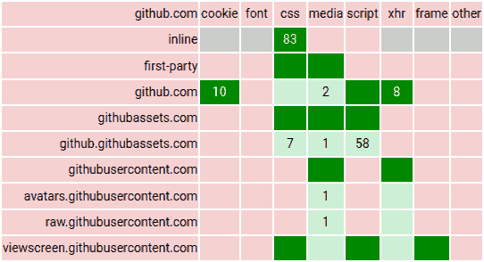

xiMatrix - block requests based on domain and type

This extension is heavily inspired by
[uMatrix](https://github.com/gorhill/uMatrix), but much simpler. By default,
all web requests as well as inline code are blocked. You can then define rules
to allow only those requests you want. Definitely for advanced users.

## Differences to uMatrix

-	advantages
	-	uMatrix is no longer maintained. The last release was in July 2021.
	-	keyboard navigation
	-	simpler code
	-	rules are encoded as JSON
	-	recording requests can be disabled to improve performance
	-	it is possible to control inline scripts, styles, and images
	-	there is a separate column for fonts
-	disadvantages / simplifications
	-	no settings at all
	-	less flexible rules
		-	there are no block rules, so it is not possible to overwrite an extensive
			allow rule with a more specific block rule
		-	images and media have been combined into a single column
		-	I am sure some of the details of the rule inheritance are different. I
			tried to produce something that works for me rather than copying every
			detail.
	-	it is not currently possible to block cookies
	-	there is no distinction between temporary and permanent rules
	-	the popup is not updated while it is open. You have to close and open it
		again to refresh the data.
	-	the icon does not show the amount of blocked requests
	-	blocked images are not replaced by a placeholder

## Known issues

-	some cached requests are not included in the request counts
